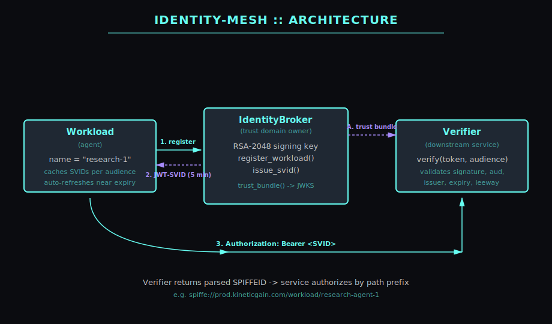
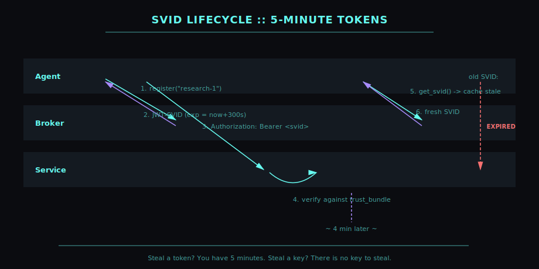

# identity-mesh 🔐

> SPIFFE-style workload identity broker for AI agents.
> Short-lived JWT-SVIDs, audience binding, zero long-lived API keys.

[](https://github.com/mizcausevic-dev/identity-mesh/actions/workflows/ci.yml)


---

## Why

Most AI agents authenticate to downstream services using long-lived API keys
baked into environment variables. Compromise one agent -> compromise everything
that key could ever touch. Indefinitely. CISO doesn't sleep.

**identity-mesh** issues short-lived (default 5 min), audience-scoped,
cryptographically signed identities to every agent on demand.

- Steal a token? You have 5 minutes.
- Steal a key? **There is no key to steal.**
- Need to revoke an agent? Stop registering it. Existing tokens age out.

## What

Five primitives, SPIFFE-compatible:

| Component | Purpose |
|---|---|
| `SPIFFEID` | Parses/validates `spiffe://trust-domain/path` URIs |
| `IdentityBroker` | Mints JWT-SVIDs (RS256), holds the trust-domain signing key |
| `Workload` | Agent-side identity holder; caches and auto-refreshes SVIDs |
| `Verifier` | Service-side validator; checks signature, audience, issuer, expiry |
| `Rotator` | Background daemon for credential rotation |

Built on `pyjwt[crypto]` and `cryptography`. No custom crypto, no surprises.

## Architecture



## SVID lifecycle

Each token lives 5 minutes by default - the agent caches it, presents it,
and refreshes it before expiry. Stolen tokens are obsolete in minutes,
not years:



## Install

```bash
pip install identity-mesh
```

Or from source:

```bash
git clone https://github.com/mizcausevic-dev/identity-mesh
cd identity-mesh
pip install -e ".[dev]"
pytest
```

## Quickstart

### Full broker -> agent -> service flow

```python
from identity_mesh import IdentityBroker, Workload, Verifier

# Security team operates the broker
broker = IdentityBroker(trust_domain="prod.kineticgain.com")

# Register an agent
agent = Workload(name="research-agent-1", broker=broker)

# Bootstrap downstream service with the trust bundle
service = Verifier(
    trust_domain="prod.kineticgain.com",
    trust_bundle=broker.trust_bundle(),
)

# Agent gets a fresh, audience-bound SVID
audience = "https://api.kineticgain.com/v1"
svid = agent.get_svid(audience)

# Service verifies - returns the caller's SPIFFE ID
caller = service.verify(svid, expected_audience=audience)
# -> spiffe://prod.kineticgain.com/workload/research-agent-1
```

### Path-prefix authorization

```python
if caller.is_under("/workload/research-"):
    # Allow only research-* agents
    handle_request(caller)
else:
    raise PermissionError("forbidden")
```

### Background rotation

```python
from identity_mesh import Rotator

# Refresh SVIDs every 4 minutes (1 min before 5-min expiry)
rotator = Rotator(
    interval=240,
    callback=lambda: agent.get_svid(audience, refresh_before=120),
)
rotator.start()
# ... later
rotator.stop()
```

## Buyer

- **CISO / Security** - eliminates long-lived API keys; satisfies SOC2 CC6.6 (logical access)
- **Platform Engineering** - drop-in zero-trust identity layer for agent fleets
- **Compliance** - every agent call is cryptographically attributable to a SPIFFE ID

## Pairs With

- [`rate-limit-shield`](https://github.com/mizcausevic-dev/rate-limit-shield) - defense-in-depth: identity at the edge, rate-limits at the model
- [`agent-router`](https://github.com/mizcausevic-dev/agent-router) - route based on `caller.path` (research vs admin agents)
- [`agent-canary`](https://github.com/mizcausevic-dev/agent-canary) - identity-based canary cohorts
- [`model-registry-pro`](https://github.com/mizcausevic-dev/model-registry-pro) - tie approval requesters / approvers to SPIFFE identities

## Roadmap

- [ ] X.509 SVIDs (alongside JWT-SVIDs)
- [ ] Workload attestation (TPM, K8s service accounts)
- [ ] gRPC SPIFFE Workload API endpoint
- [ ] OIDC discovery + JWKS endpoint
- [ ] HSM / KMS adapter for key custody
- [ ] Distributed broker (Redis/etcd) for multi-region
- [ ] PyPI release

## Doctrine

> *"Long-lived credentials are tomorrow's incident reports."*

Three rules:

1. **Short TTL or no TTL.** Five minutes is cheap, breach blast-radius is not.
2. **Audience-bound.** A token for service A must be useless against service B.
3. **Rotate the broker key, rotate everyone's trust.** Plan the day-one rotation on day zero.

## Security Notes

- Broker generates a fresh RSA-2048 key per instance. **Persist it** for production
  (mount from secrets manager or KMS).
- Default leeway is 5 seconds clock-skew. Tighten in adversarial environments.
- This library does **not** ship a transport. Pass SVIDs over mTLS or HTTPS only.

## License

MIT - see [LICENSE](./LICENSE).

---

Built by [Mirza Causevic](https://github.com/mizcausevic-dev) - Part of the
[mizcausevic-dev](https://github.com/mizcausevic-dev) AI platform engineering portfolio.

---

**Connect:** [LinkedIn](https://www.linkedin.com/in/mirzacausevic/) · [Kinetic Gain](https://kineticgain.com) · [Medium](https://medium.com/@mizcausevic/) · [Skills](https://mizcausevic.com/skills/)
